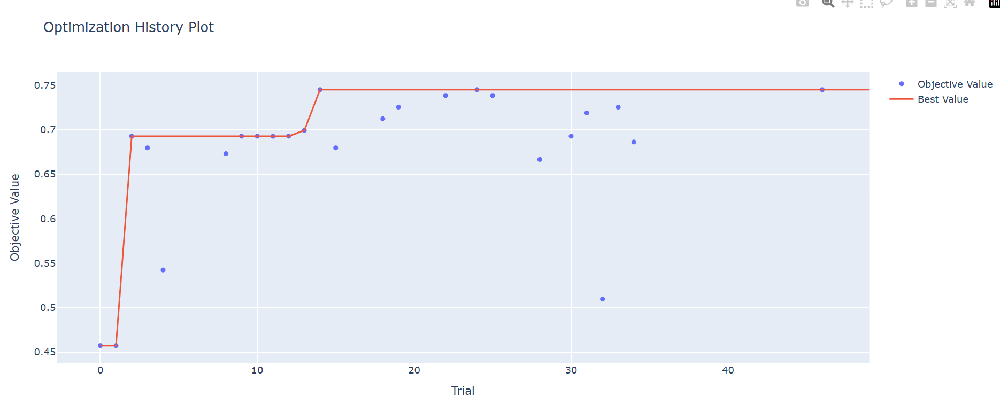
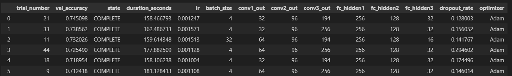

Hyper tuning exercise:

I've set up a model in collaboration with claude. To detect bees and ants from iamges. hypertune_exercise_2.ipynb
For the data setup I chose not to use batch normalization. Claude advised not to use it because the dataset is so small.

I've set up the model with 3 convolutional blocks. en three linear layers. For hypertuning ive setup Fortuna based system, advised by Claude. Every model trained for 10 epochs.

Below a visual for the first of the first hypertune session and some scores. These result were achieved without transfer learning.

[I 2025-10-05 13:59:18,753] Trial 24 finished with value: 0.7450980392156863 and parameters: {'lr': 0.0005187264323843489, 'batch_size': 8, 'conv1_out': 32, 'conv2_out': 128, 'conv3_out': 192, 'conv4_out': 384, 'fc_hidden1': 256, 'fc_hidden2': 128, 'fc_hidden3': 32, 'dropout_rate': 0.10117247262913878, 'optimizer': 'Adam'}. Best is trial 14 with value: 0.7450980392156863.
[I 2025-10-05 13:54:25,361] Trial 22 finished with value: 0.738562091503268 and parameters: {'lr': 0.0002045751841323453, 'batch_size': 8, 'conv1_out': 32, 'conv2_out': 128, 'conv3_out': 192, 'conv4_out': 384, 'fc_hidden1': 256, 'fc_hidden2': 128, 'fc_hidden3': 32, 'dropout_rate': 0.11366390350512119, 'optimizer': 'Adam'}. Best is trial 14 with value: 0.7450980392156863.
[I 2025-10-05 13:33:09,376] Trial 14 finished with value: 0.7450980392156863 and parameters: {'lr': 0.0010500685682880713, 'batch_size': 8, 'conv1_out': 32, 'conv2_out': 128, 'conv3_out': 192, 'conv4_out': 512, 'fc_hidden1': 256, 'fc_hidden2': 128, 'fc_hidden3': 32, 'dropout_rate': 0.14044857487962287, 'optimizer': 'Adam'}. Best is trial 14 with value: 0.7450980392156863.

The results where difficult to analyze because only the best model was shown and some in between screenprints. Therefore I decided to change the code so that the results are saved in a dataframe and it is easier to analyze what is happening. 
By using the dataframe it was possible to recognize the similarities between the models and identifies where the model seems to score the best.

Changes in the learning rate, skiplayers and dropout rate all changed the performance only minor bits.
In the end adding the transferlearning gave the biggest jump in performance. This gave nearly 20% performance gain. 0.967320

It was probably better to start of by adding the transferlearning and focus more more on the linear layer training. This would have narrowed down the vector space to do the hypertuning on.

Tests:
Changes based on first session: learningrate domain smaller, around the best result from session 1. Dropoutrate domain smaller around the best results from session 1. Squeeze on the number of hidden units because I noticed that this probably did not have to much effect after a certain number. Set a domain in the hidden units instead of one number. Reduced the number of optimizer to only adam. Changed the code to log into a pandas dataframe.

I expect similar result as in the first run. There are no dramatic changes to the models. In my opinion this is more about getting the biggest bang for the buck. So less computing with similar scores.

Result:

There seems to be a clear pattern on the number of hidden units in the results. The learning rate and the dropout are less stable. Next test should reduce the test to fixed numbers of hidden units and convolutional layers. Because no big changes are happening. I've narrowed down the hypertuning dimensions. And restarted the test.

Change by adding skiplayer after every convolutional layer. I expect an increase in result.

The result was sleightly worse then without the skip connections. The model is constrained on the number of channels and the number of linear layers. There is a indication that the amount of dropout can be sleightly larger.

Change the dropout domain to be narrow and loosen the amount of channels for the convolutional layers. I expect no great difference yet, because the whole system needs to be tuned again.
The result is that the number of convolutional layers is bigger then the numer of units in the first linear layer.
Change to constrain the conv layers and enlarge the linear layers. 0.738562

add more conv and more hidden units. Performance stayed the same.

Change add transferlearning. The performance will increase significantly.

The performance jumped to 0.9673.
